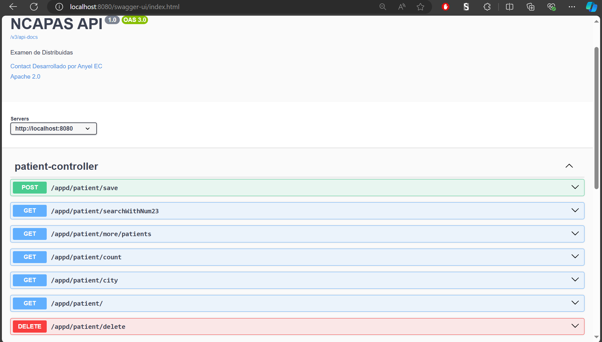
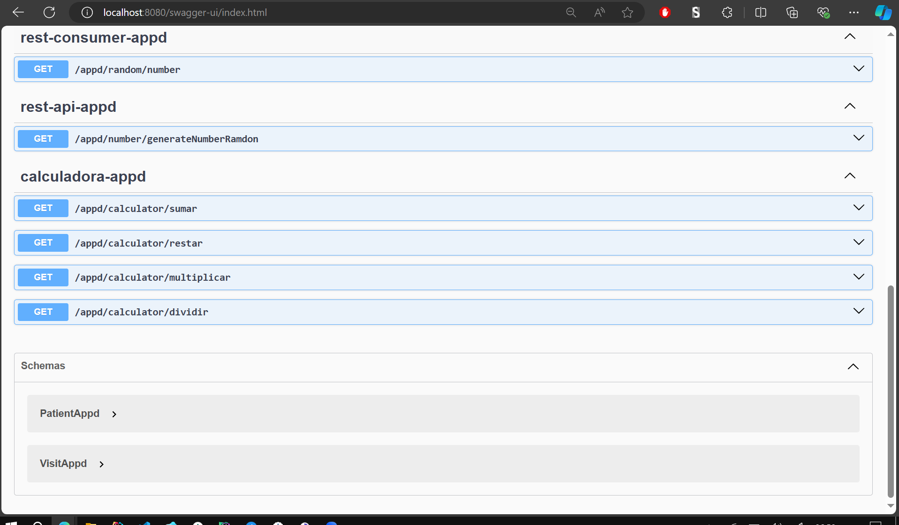

# **Select Language:** 🌍
- [Español (Spanish)](README-es.md)
- [English](README.md)

# Spring Boot Project: Appd

This is a Spring Boot project that includes various controllers, services, and repositories to handle calculator operations, generate random numbers, manage patients, and consume an external REST service.

## RESULTS
### Swagger Documentation Part 1

### Swagger Documentation Part 2


## Project Structure

### Packages

- `top.anyel.querys.config_appd`: Configuration of the application environment.
- `top.anyel.querys.controllers_appd`: REST controllers to handle HTTP requests.
- `top.anyel.querys.repositories_appd`: Repositories to access and manipulate data.
- `top.anyel.querys.servicies_appd`: Services that contain the business logic.

### Main Components

#### Configuration

- `AppEnvironment`: Class that loads environment variables using the `dotenv` library.

#### Controllers

- `CalculadoraAppd`: Provides endpoints for addition, subtraction, multiplication, and division operations.
- `PatientController`: Provides endpoints to manage patients (create, list, search, count, and delete).
- `RestApiAppd`: Provides an endpoint to generate a random number.
- `RestConsumerAppd`: Provides an endpoint to consume a number from an external REST service.

#### Repositories

- `CalculadoraRepositoryAppd`: Methods to perform mathematical operations.
- `GenerateRepositoryAppd`: Method to generate a random number.
- `PatientRepositoryAppd`: Methods to manage the list of patients.
- `RestConsumerRepository`: Method to consume a number from an external REST service.

### Services

- `CalculadoraServiceAppd`: Contains the business logic for calculator operations.
- `PatientServiceAppd`: Contains the business logic for patient management.
- `GenerateServiceAppd`: Contains the logic to generate a random number.
- `RestConsumerServiceAppd`: Contains the logic to consume an external REST service.

## Prerequisites

- Java 11 or higher
- Maven
- Spring Boot 2.5.x or higher

## Environment Setup

Make sure you have a `.env` file at the root of the project with the following variables:

```
BASE_URL=http://example.com/api
```

## Running the Application

1. Clone the repository:
   ```bash
   git clone https://github.com/Anyel-ec/Spring-Boot-Querys-List-InMemory
   ```

2. Navigate to the project directory:
   ```bash
   cd Spring-Boot-Querys-List-InMemory
   ```

3. Build the project with Maven:
   ```bash
   mvn clean install
   ```

4. Run the application:
   ```bash
   mvn spring-boot:run
   ```

## Endpoints

### Calculator

- `GET /appd/calculator/sumar?a={num1}&b={num2}`: Adds two numbers.
- `GET /appd/calculator/restar?a={num1}&b={num2}`: Subtracts two numbers.
- `GET /appd/calculator/multiplicar?a={num1}&b={num2}`: Multiplies two numbers.
- `GET /appd/calculator/dividir?a={num1}&b={num2}`: Divides two numbers.

### Patients

- `POST /appd/patient/save`: Saves a new patient.
- `GET /appd/patient/`: Lists all patients.
- `GET /appd/patient/searchWithNum23`: Searches patients whose identification number contains "23".
- `GET /appd/patient/city?city_appd={city}`: Lists patients in a specific city.
- `GET /appd/patient/more/patients`: Lists patients with more visits.
- `GET /appd/patient/count?city_appd={city}`: Counts patients in a specific city.
- `DELETE /appd/patient/delete?city_appd={city}`: Deletes patients whose city starts with a specific name.

### Random Number

- `GET /appd/number/generateNumberRamdon`: Generates a random number.

### REST Consumer

- `GET /appd/random/number`: Consumes a number from an external REST service.

## License

This project is licensed under the MIT License. For more details, see the [LICENSE](LICENSE) file.

## Contact

For more information or inquiries, please contact [appatino@espe.edu.ec](mailto:apaptino@espe.edu.ec).